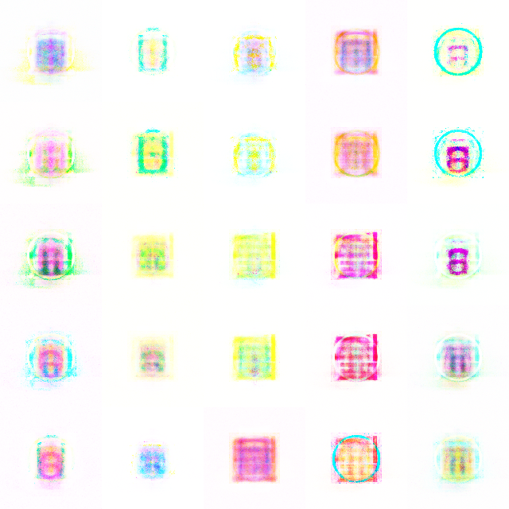
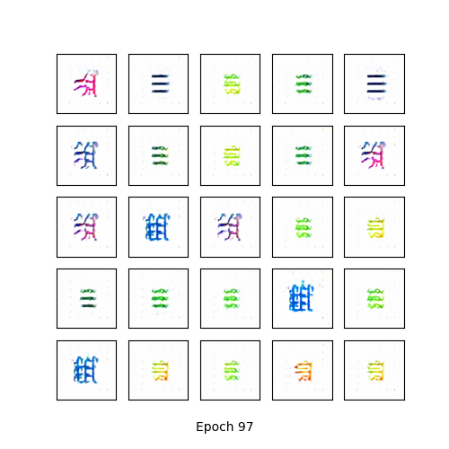

# stylegan using jittor
## gan.py
使用比较简单的GAN结构
+ Generator: 4个 (Linear+BatchNorm1d+LeakyReLU) + Linear + Tanh
+ Discriminator: 2个(Linear+LeakyReLU) + Linear + Sigmoid
+ Loss: BCELoss

生成结果只能看出是模糊的符号，如下图

Reference:
+ [dataset](https://cg.cs.tsinghua.edu.cn/jittor/assets/docs/jittor.dataset.html?highlight=image#jittor.dataset.ImageFolder)
+ [jittor lsgan教程](https://cg.cs.tsinghua.edu.cn/jittor/tutorial/2020-3-17-09-54-gan/)

## lsgan.py
LSGAN的结构参考了[jittor lsgan教程](https://cg.cs.tsinghua.edu.cn/jittor/tutorial/2020-3-17-09-54-gan/)，其中的结构如下图

+ Loss: 最小平方差(Least Sqaure)

生成结果可以看出是符号，但是和字符差距较大，如下图

## stylegan.py
+ upsample模块
  > We replace the nearest-neighbor up/downsampling in both networks with bilinear sampling, which we implement by lowpass filtering the activations with a separable 2nd order binomial filter after each upsampling layer and before each downsampling layer.

  使用bilinear sampleing和filter;每一层后面跟随[smooth](https://nn.labml.ai/gan/stylegan/index.html)(实现上为`blur`模块)
+ [Equalized Learning Rate](https://www.yuthon.com/post/tutorials/from-progan-to-stylegan/#equalized-learning-rate)
  
  为了保证Generator与Discriminator之间的良性竞争，ProGAN指出需要使得各个卷积层以相似的速度进行学习。为了达到equlized learnig rate，ProGAN采用了与He initialization相似的方法，也就是将每个层的权重乘以其权重参数量。而且不仅仅是初始化权重时这么做，在训练过程的每次forwarding时都进行此操作。
  $$W=W_{orig}\times \sqrt{\frac{2}{fan\_in}}$$
+ 隐空间插值
+ loss函数使用jittor的[step](https://cg.cs.tsinghua.edu.cn/jittor/assets/docs/jittor.nn.html?highlight=backward#jittor.nn.backward)，隐含先对梯度置零，然后求导，但是和源代码稍有差异，源代码是对每部分的loss_i求梯度，然后加在一起。
训练30000次后的生成结果如下图，其实也看不出符号的样子，虽然训练了很多次，反复训练6次，前5次10000次迭代，最后一次30000次迭代。**可能是代码有问题**，但是比对并没有发现是哪里出了错误，找不到bug放弃了。

[cuda ptx](https://zhuanlan.zhihu.com/p/432674688)
## reference
+ `A Style-Based Generator Architecture for Generative Adversarial Networks` https://arxiv.org/abs/1812.04948
+ [StyleGAN阅读总结](https://zhuanlan.zhihu.com/p/63230738)
+ [GAN简介](https://zhuanlan.zhihu.com/p/62746494)
+ [LSGAN](https://arxiv.org/abs/1611.04076)
+ [中文机翻](https://blog.csdn.net/a312863063/article/details/88761977)
+ [Nvidia stylegan 使用](https://blog.csdn.net/weixin_41943311/article/details/100539707)
+ [pytorch 版](https://github.com/rosinality/style-based-gan-pytorch)
+ [Paddle实现gan](https://zhuanlan.zhihu.com/p/144599727)
+ [jittorgan](https://github.com/xUhEngwAng/StyleGAN-jittor/blob/master/model.py)

+ [jittor 性能测试](https://cg.cs.tsinghua.edu.cn/jittor/assets/docs/Jittor%E6%80%A7%E8%83%BD%E6%B5%8B%E8%AF%95%E4%B8%8E%E5%AF%B9%E6%AF%94%E6%96%B9%E6%B3%95.html)
+ https://docs.qq.com/doc/DSEREdkFSZ2xGaWNC
+ [gpu编程](https://face2ai.com/program-blog/#GPU编程（CUDA）)
